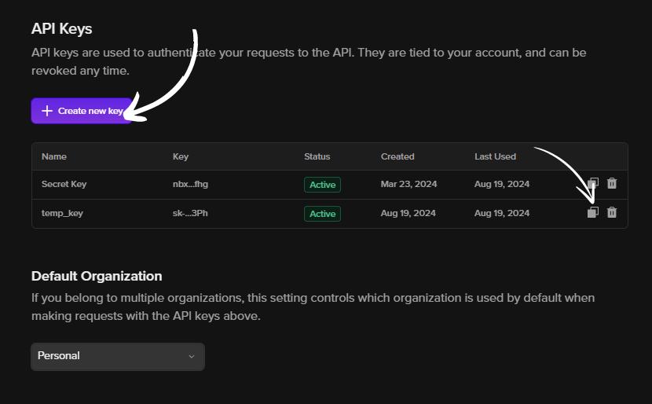
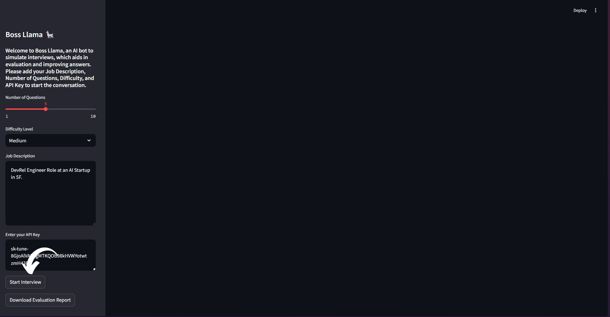
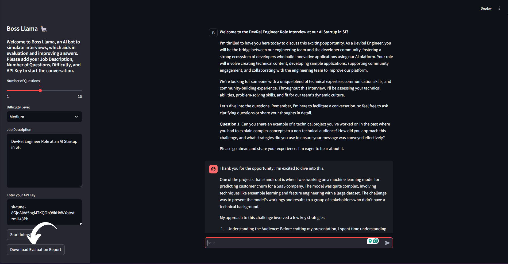

# Boss Llama 🦙
[](https://)
[](https://www.python.org/)
[](https://pypi.python.org/pypi/ansicolortags/)


Welcome to Boss Llama, an LLM aided Interview Simulation Web Application. The web-applications gives the users the ability to seamlessly integrate [Tune Studio](https://studio.tune.app/playground) and Streamlit for Smart Interview Simulation. This simple implementation aims to showcase handling textual data and basic web application workings such as creating and downloading reports and files using [Llama 3.1 70B](https://ai.meta.com/blog/meta-llama-3-1/), sourced from Tune Studio API. 

## Steps to Run
#### Clone the Repository
``` git clone https://github.com/aryankargwal/boss_llama.git```
#### Install Dependencies
``` pip install -r requirements.txt```
#### Run Streamlit Application
``` streamlit run app.py```
#### Put Tune Studio API Key
##### Download your Tune Studio API Key from `Personal>View API Keys`


#### Tweak Parameters and Put Job Description


#### Download Evaluation Report


## Possible Features
- [ ] Upload Resume for personal interview
- [ ] VLM Integration

## Further Reading
- [Llama 3.1 Integration with Tune Studio](https://tunehq.ai/blog/tune-ai-integrates-latest-llama-3-1)
- [Finetuning on Tune Studio](https://tunehq.ai/blog/finetuning-llms)

## License
This repository is under the MIT License. Read more [here](LICENCE).

